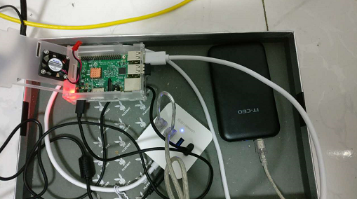

#smart-pi
基于树莓派3的智能设备
 
### 2016.10.17 23:42
要给自己找点事情做，手上有一块闲置了很久的树莓派3，可以用它来做些什么有趣的东西。
初步打算做一个语音识别，然后在加上一些乱七八糟的东西上去。
关于语言的选用：java可能会支持的库比较多，python不熟悉，不过感觉python会是最佳的选择。

### 2017.4.20 16:11
有时间可以挂一个硬盘

### 2017.4.28
前几天硬盘已经挂上了。硬盘用的是从mac mini上拆下来的，外加一个硬盘盒组装的移动硬盘。

买了一个usb 3.0 4口带供电的hub。电源功率是5V 2A，所有供电都由这个电源供电，包括pi和移动硬盘，接到pi上usb口就一个无线鼠标接口和一个hub。
完美稳定运行。而且移动硬盘带自动休眠，虽然pi上的是usb2.0接口，但是也应该能跑满usb2.0的速度。hub这个东西，一分钱一分货，要买好的。
在上面还搭建了一个svn服务器。目前好像还有点问题
